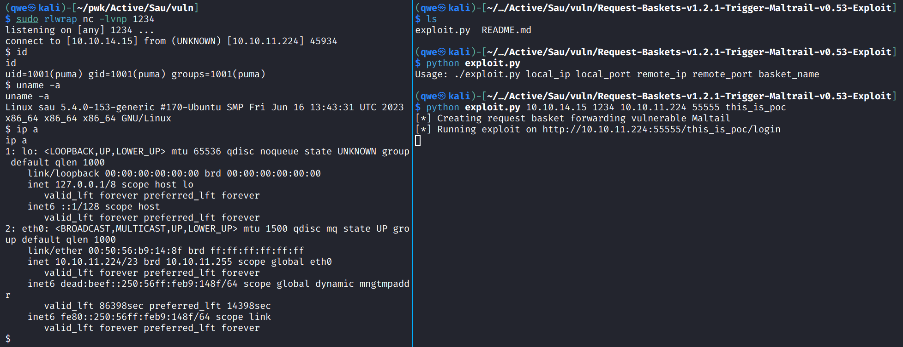

This Python script exploits a command injection vulnerability in the Maltrail (v0.53) web service triggered by the usage of SSRF, Request Basket (v1.2.1).

- The Request Baskets vulnerability exists in the new basket operation, causing a server-side request forgery via `/api/baskets/{name}`, able to expose Maltail service.
- The Maltrail vulnerability exists in the login page and can be exploited via the `username` parameter.

## Request Basket

request-baskets up to v1.2.1 was discovered to contain a Server-Side Request Forgery (SSRF) via the component /api/baskets/{name}. This vulnerability allows attackers to access network resources and sensitive information via a crafted API request.

## Maltrail 

### Vulnerability Explanation

[In this specific case,](https://github.com/stamparm/maltrail/blob/master/core/httpd.py#L399) the `username` parameter of the login page doesn't properly sanitize the input, allowing an attacker to inject OS commands  

The service uses the `subprocess.check_output()` function to execute a shell command that logs the username provided by the user. If an attacker provides a specially crafted username, they can inject arbitrary shell commands that will be executed on the server

In shell scripting, the semicolon `;` is used to separate multiple commands. So, when the attacker provides a username that includes a semicolon, followed by a shell command, the shell treats everything after the semicolon as a separate command. Basically, everything after `;` will run anyway.

### Exploit Overview

The exploit creates a reverse shell payload encoded in Base64 to bypass potential protections like WAF, IPS or IDS and delivers it to the target URL using a curl command  
The payload is then executed on the target system, establishing a reverse shell connection back to the attacker's specified IP and port

## Usage

Tools supposed to be installed before:

1. python: requests
2. curl

```sh
python3 exploit.py <local_ip> <local_port> <remote_ip> <remote_port> <basket_name>
```  
For example:
```sh
# local host cmd1:
sudo nc -lvnp 1234
# local host cmd2:
python3 exploit.py 10.10.10.10 1234 10.10.10.11 8080 basket
```



## Disclaimer
This is intended for educational purposes and legal use only.  
Always obtain proper authorization before performing penetration testing or exploiting vulnerabilities.

## Ressource
- https://huntr.dev/bounties/be3c5204-fbd9-448d-b97c-96a8d2941e87/
- https://github.com/spookier/Maltrail-v0.53-Exploit/
- https://nvd.nist.gov/vuln/detail/CVE-2023-27163
